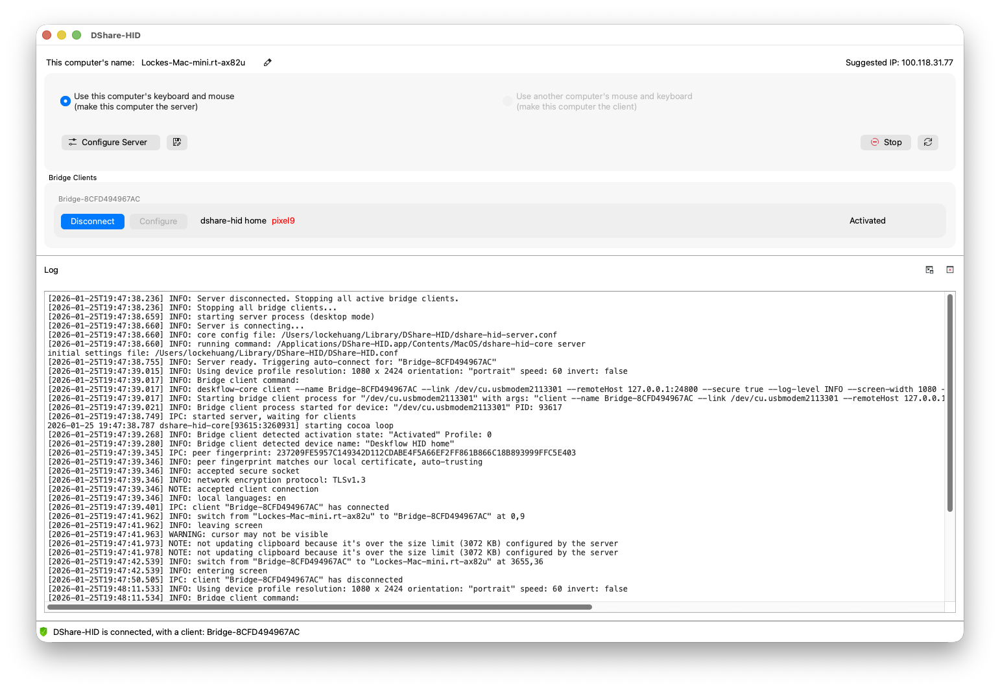

# Deskflow-HID: 与移动设备共享键盘和鼠标

 

[ English ](README.md) | **[ 简体中文 ]**

---

<p align="center">
  
</p>

## 简介

Deskflow-HID 是 [Deskflow](https://github.com/deskflow/deskflow) 项目的高性能开源扩展。Deskflow-HID 支持 **Linux、Windows 和 macOS**，专注于与包括 iPad、iPhone 和 Android 手机在内的移动设备共享键盘和鼠标输入。

## 扩展 Deskflow 生态系统：移动集成

传统的软件 KVM 解决方案（如 Deskflow）在计算机之间表现出色，但无法支持 iPadOS 或 Android 等移动平台。Deskflow-HID 通过将 Deskflow 的功能扩展到这些设备来弥补这一差距：
- **iOS 和 Android** 出于安全原因，不允许后台应用拦截或模拟系统级的 HID（人机接口设备）事件。
- **远程桌面** 解决方案通常存在高延迟，并且依赖于网络稳定性，这会影响流畅的实时外设共享。

## 解决方案：硬件辅助桥接

Deskflow-HID 使用经济实惠（AliExpress 上约 2.5 美元）的 **ESP32-C3 Supermini** 开发板作为物理硬件桥接器。它将 Deskflow 事件转换为 **低功耗蓝牙 (BLE) HID**，让您能够通过无线方式与任何移动设备共享键盘和鼠标。

<br/>  <br/> <sub>图片来源: [Josselin Hefti](https://www.printables.com/model/1360390-esp32-c3-super-mini-model)</sub>

## 📸 界面预览

|                       主界面 (Main UI)                        |                         设备配置 (Device Configuration)                          |
| :-----------------------------------------------------------: | :------------------------------------------------------------------------------: |
|  |  |

## 主要特性

- **免驱动**: 标准蓝牙 HID 协议，目标设备无需安装应用或驱动。
- **低延迟**: 直接 BLE 通信。
- **跨平台**: 支持 **Windows, macOS, Linux** 主机。兼容官方上游 Deskflow 客户端。
- **多设备**: 支持连接并切换最多 **6 台移动设备**。
- **媒体键**: 支持播放/暂停、音量调节和静音。


> [!NOTE]
> **剪贴板共享**: 目前不支持 Deskflow 的网络剪贴板共享，但在未来的更新中会支持。

## 📥 安装指南

我们提供适用于所有主流平台的预编译安装包。请选择适合您环境的版本。

### macOS (通用版本)
适用于 macOS 12+ (Intel & Apple Silicon)。

#### 选项 A: Homebrew (已禁用 - 即将支持)
此选项目前已禁用，将在未来的更新中支持。

<!--
```bash
# 1. 添加 Tap 仓库
brew tap lockekk/deskflow

# 2. 安装
brew install --cask deskflow-hid

# 卸载
brew uninstall deskflow-hid

# 更新
brew upgrade deskflow-hid
```
-->

#### 选项 B: 手动安装
1.  从 [Releases](https://github.com/lockekk/deskflow-hid/releases) 页面下载最新的 `.dmg` 文件。
2.  打开 `deskflow-hid-1.25.0-macos-universal.dmg` 并将应用程序拖入 `Applications` 文件夹。
3.  **注意**: 如果遇到“已损坏”或“无法验证”的错误提示，请在终端中运行以下命令：
    ```bash
    xattr -cr /Applications/Deskflow-HID.app
    ```

> [!IMPORTANT]
> **权限与设置**:
> - **辅助功能**: 您必须在“隐私与安全性”中授予 **Deskflow-HID** 应用程序和 **deskflow-hid** 进程“辅助功能”权限。
> - **macOS Sequoia**: 您可能还需要在“本地网络”设置中允许 Deskflow-HID。
> - **升级**: 如果您正在升级且允许列表中已存在旧版条目，您可能需要**手动移除**它们，然后重新授予新版本辅助功能权限。

### Windows
**依赖项**: 使用前请确保已安装 **Microsoft Visual C++ Redistributable v14.44 或更高版本**。

提供便携版 (推荐) 和安装版。

-   **便携版 (.7z)**: **推荐**。解压后直接运行 `Deskflow-HID.exe`。
-   **安装版 (.msi)**: 下载后双击安装即可。

### Linux
我们支持通过 AppImage 和 Flatpak 在主流发行版上运行。

> [!IMPORTANT]
> **权限**: 为了访问 USB 设备，您的用户 **必须** 拥有访问串口的权限（通常是 `dialout` 用户组）。
> 运行以下命令，然后 **注销并重新登录**（或 **重启**）以使更改生效：
> ```bash
> sudo usermod -a -G dialout $USER
> ```

#### 选项 A: AppImage (通用)
适用于较新的 Linux 发行版 (Ubuntu 22.04+, Fedora 36+ 等)。

1.  从 [Releases](https://github.com/lockekk/deskflow-hid/releases) 下载 `.AppImage` 文件。
2.  赋予可执行权限:
    ```bash
    chmod +x deskflow-hid-1.25.0-x86_64.AppImage
    ```
3.  运行:
    ```bash
    ./deskflow-hid-1.25.0-x86_64.AppImage
    ```

#### 选项 B: Flatpak
请从我们的 [Releases](https://github.com/lockekk/deskflow-hid/releases) 页面下载 `.flatpak` 文件并进行本地安装。

**1. 准备 Flatpak**
如果您从未更使用过 Flatpak，请确保已安装它并添加了 Flathub 仓库：
```bash
# Debian/Ubuntu
sudo apt install flatpak

# Fedora
sudo dnf install flatpak

# Arch Linux
sudo pacman -S flatpak

# 添加 Flathub 仓库 (所有发行版)
flatpak remote-add --if-not-exists flathub https://dl.flathub.org/repo/flathub.flatpakrepo
```

**2. 安装**
```bash
flatpak install --user ./deskflow-1.25.0-linux-x86_64.flatpak
```

**3. 管理应用**
```bash
# 卸载
flatpak uninstall org.deskflow.hid

# 重装 (先卸载再安装)
flatpak uninstall org.deskflow.hid
flatpak install --user ./deskflow-1.25.0-linux-x86_64.flatpak
```

#### 选项 C: Debian 软件包 (Ubuntu 24+)
适用于 Ubuntu 24.04 及更新版本。

1.  从 [Releases](https://github.com/lockekk/deskflow-hid/releases) 下载 `.deb` 文件。
2.  安装:
    ```bash
    sudo apt install ./deskflow-hid_1.25.0_ubuntu_24_amd64.deb
    ```
3.  卸载:
    ```bash
    sudo apt remove deskflow-hid
    ```

## 首次使用与烧录指南

<div align="center">
  
</div>

### 1. 准备硬件
您需要准备一个 **ESP32-C3 Super Mini** 开发板。这些板子价格实惠，在淘宝或速卖通均可轻松买到。通过 USB 将其连接到您的电脑。

### 2. 打开烧录工具
打开 Deskflow-HID，点击菜单栏的 **File -> Firmware** 进入管理界面。

### 3. 设置流程 (针对新设备)
对于全新的“空白”设备，请按以下步骤操作：

1.  **工厂模式 (在线烧录)**:
    *   进入 **Factory Mode** (工厂模式) 标签页。
    *   在 "Online" (在线) 区域点击 **Flash**，烧录通用的工厂固件。
    *   这会让设备准备好进行配对和授权。

2.  **申请设备专属应用**:
    *   进入 **Order** (订单) 标签页。
    *   选择 **Request 7-Day Free Trial** (申请7天免费试用) 或 **Purchase Full License** (购买完整授权)。
    *   填写您的信息并点击 **Email** 发送请求。
    *   您将通过邮件收到一个专属的 **设备固件文件** (例如 `app_xxxx.uzip`)。

3.  **安装应用 (手动)**:
    *   进入 **Upgrade Mode** (升级模式) 标签页。
    *   在 "Manual" (手动) 区域，浏览并选择您收到的固件文件。
    *   点击 **Flash** 烧录您的授权固件。

### 4. 更新与维护
*   **升级**: 进入 **Upgrade Mode** (升级模式) 标签页，点击 **Check for Updates** -> **Flash** 即可在线升级最新功能。
*   **激活**: 进入 **Activation** (激活) 标签页查看授权状态或输入新的激活码。

## 从源码构建
Deskflow-HID 的开发环境和构建过程与上游 [Deskflow 项目](https://github.com/deskflow/deskflow) **完全相同**。您可以遵循 Windows、macOS 和 Linux 的官方构建说明。

**注意**: 固件烧录和认证模块属于可选组件，不包含在核心开源项目中。欢迎用户自行构建和使用自定义固件实现。

## 开源与商业条款
Deskflow-HID 本质上是一个开源项目。桌面应用程序和桥接架构开放供贡献和社区改进。

- **7 天全功能试用**: 免费体验固件和软件的全部功能 7 天。
- **终身价值**: 试用期过后，一次性激活即可提供 **通过 OTA 的终身免费升级** 和 **终身维护**。

## 致谢
特别感谢 [Deskflow](https://github.com/deskflow/deskflow) 项目及其贡献者。本项目建立在他们的坚实基础之上。

同时感谢 [Josselin Hefti](https://www.printables.com/model/1360390-esp32-c3-super-mini-model) 提供的 ESP32-C3 Supermini 精美 3D 模型图片。

## 支持与联系
- **邮箱**: [deskflow.hid@gmail.com](mailto:deskflow.hid@gmail.com)
- **问题反馈**: 请通过 [GitHub Issues](https://github.com/lockekk/deskflow-hid/issues) 提交 Bug 或建议。

## 免责声明与法律信息
Deskflow-HID 是一个开源项目。但是，某些可选功能（如固件管理）可能依赖于专有组件。核心应用程序在没有这些组件的情况下仍然功能齐全且开源。

## 许可证
Deskflow-HID 遵循 **GNU General Public License v2.0 (GPL-2.0-only)** 许可。此项目是基于 [Deskflow](https://github.com/deskflow/deskflow) 的衍生作品。

有关更多详细信息，请参阅此存储库中的 [LICENSE](LICENSE) 文件。

加入 Deskflow-HID，开启跨平台生产力的未来。
